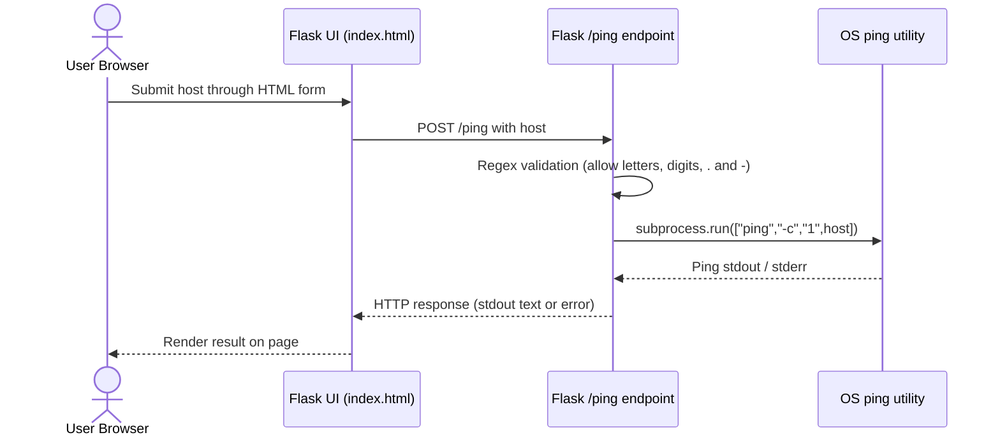
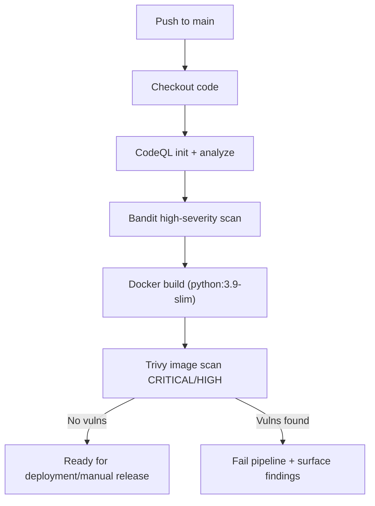
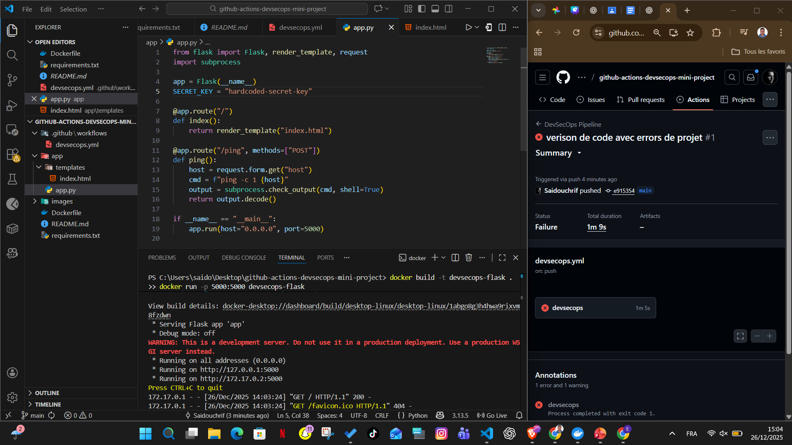
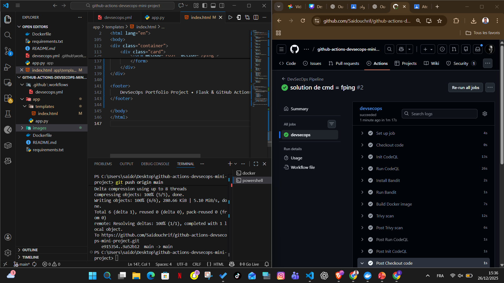
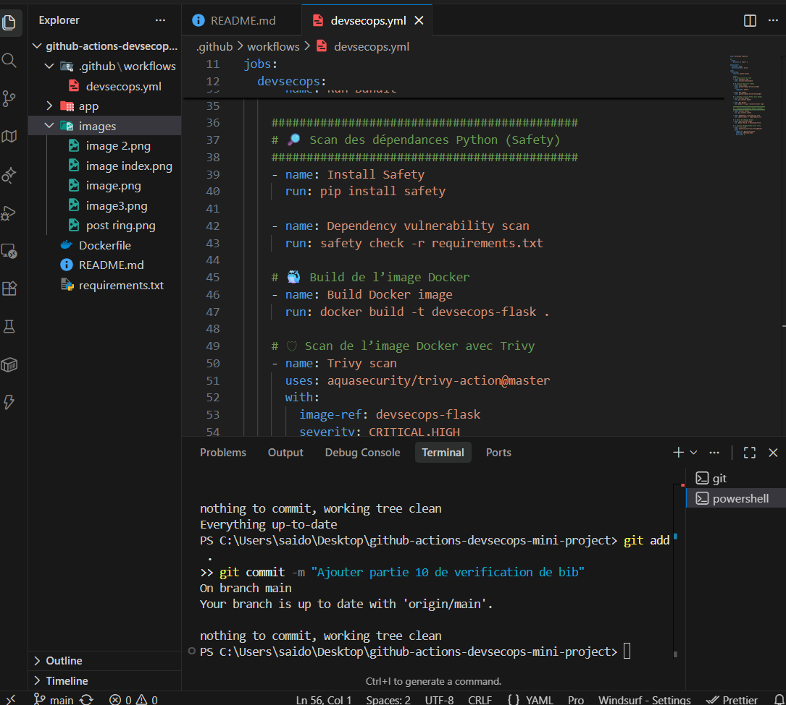

# DevSecOps Flask Mini Project

Lightweight Flask application packaged in Docker and guarded by a security-first CI/CD pipeline built on GitHub Actions. The repository demonstrates how CodeQL, Bandit, Trivy, and container builds can be chained to secure even a small project.

---

## Table of Contents

1. [Overview](#overview)
2. [Architecture & Workflow](#architecture--workflow)
3. [Repository Structure](#repository-structure)
4. [Getting Started](#getting-started)
5. [API Usage](#api-usage)
6. [CI/CD & Security Tooling](#cicd--security-tooling)
7. [Known Issues & Errors Found](#known-issues--errors-found)
8. [Screenshots](#screenshots)

---

## Overview

- **Stack:** Flask 2.3 served by Python 3.9 inside a Docker container, exposed on port 5000 (@app/app.py#1-30, @Dockerfile#1-12).
- **Primary feature:** a `/ping` form that lets you send a single ICMP ping to any hostname for demonstration and testing.
- **Security focus:** every push to `main` runs a DevSecOps workflow with static analysis (CodeQL), dependency scanning (Bandit), and container scanning (Trivy) (@.github/workflows/devsecops.yml#1-45).
- **Use case:** learning how to wire a minimal web app into a secure CI/CD pipeline, and showcasing screenshots for a portfolio or presentation.

---

## Architecture & Workflow

### 1. Application flow (UML Sequence)



**Step-by-step explanation**
1. The user interface in `templates/index.html` renders the single form and posts to `/ping` without reloading the page structure.
2. `app.py` receives the POST request, sanitizes the hostname via regex, and rejects anything containing characters outside `[a-zA-Z0-9.\-]`.
3. Once validated, the endpoint launches the system `ping` command with a single packet (`-c 1`) using `subprocess.run`.
4. The command output (success, timeout, or OS-level error) is streamed back as the HTTP response body, so users immediately see raw ping statistics.

### 2. CI/CD & security workflow (UML Activity)



**What happens in the pipeline**
1. Every push to `main` triggers `.github/workflows/devsecops.yml`.
2. CodeQL performs static analysis against the Python sources before any build occurs.
3. Bandit runs in high-severity mode on the `app` directory to catch insecure code patterns.
4. Docker builds the image defined in `Dockerfile`; this ensures the artifact that is scanned matches what will eventually run.
5. Trivy inspects the freshly built image and blocks the job if any HIGH or CRITICAL vulnerabilities remain (because `exit-code: 1`).
6. Only when all gates succeed is the build considered safe to deploy or tag.

---

## Repository Structure

```
.
 .github/workflows/devsecops.yml   # CI/CD & security pipeline
 app/
    app.py                        # Flask application & /ping endpoint
    templates/index.html          # Single-page UI
 Dockerfile                        # Python 3.9 slim container
 requirements.txt                  # Flask dependency pin
 images/                           # Screenshots used in the README
```

---

## Getting Started

### Prerequisites
- Python  3.9
- pip
- (Optional) Docker Desktop

### Local development (Python)
```bash
python -m venv .venv
.venv\Scripts\activate  # Windows
pip install -r requirements.txt
python app/app.py
```
Visit `http://localhost:5000`.

### Docker
```bash
docker build -t devsecops-flask .
docker run -p 5000:5000 devsecops-flask
```

> **Note:** The base image is `python:3.9-slim`. If you want the `/ping` endpoint to work inside the container, install `iputils-ping` (see [Known Issues](#known-issues--errors-found)).

---

## API Usage

| Method | Endpoint | Description |
| ------ | -------- | ----------- |
| GET    | `/`      | Renders the landing page with the ping form (@app/app.py#7-10, @app/templates/index.html#1-145). |
| POST   | `/ping`  | Validates the `host` field and executes a single ping (`ping -c 1 host`) (@app/app.py#11-26). |

Example request:
```bash
curl -X POST -F "host=example.com" http://localhost:5000/ping
```

---

## CI/CD & Security Tooling

| Stage | Tool | Purpose |
| ----- | ---- | ------- |
| Checkout | `actions/checkout@v3` | Pulls repository content for the workflow |
| Static Analysis | `github/codeql-action` | Scans Python code for vulnerabilities (@.github/workflows/devsecops.yml#19-27) |
| Dependency SAST | `bandit -r app --severity-level high` | Flags high-severity Python issues (@.github/workflows/devsecops.yml#28-34) |
| Container Build | `docker build -t devsecops-flask .` | Ensures the image builds before scanning (@.github/workflows/devsecops.yml#35-38) |
| Container Scan | `aquasecurity/trivy-action` | Blocks on HIGH/CRITICAL findings via `exit-code: 1` (@.github/workflows/devsecops.yml#39-45) |

Pipeline trigger: every push to `main`.

---

## Known Issues & Errors Found

1. **Missing `ping` binary inside the container**  
   The base image (`python:3.9-slim`) does not ship with `iputils-ping`, so the `/ping` endpoint fails with `ping: command not found` when the Flask server runs inside Docker (@Dockerfile#1-12).  
   _Fix_: update the Dockerfile with `apt-get update && apt-get install -y iputils-ping`.

2. **Unix-only ping flag**  
   `subprocess.run(["ping", "-c", "1", host], ...)` uses the `-c` flag, which is unavailable on Windows (`ping` expects `-n`). Local runs on Windows therefore raise `ping: invalid option -- 'c'` (@app/app.py#19-24).  
   _Fix_: detect the platform and switch to `-n` for Windows hosts.

3. **No timeout or error handling for failed subprocess calls**  
   If a hostname never responds, the request can hang until the OS-level ping timeout and still returns HTTP 200 with empty output because `check=True` is not used and stderr is ignored (@app/app.py#19-26).  
   _Fix_: set `timeout`, inspect `returncode`, and return meaningful HTTP status codes.

4. **Form endpoint exposed without CSRF/authentication**  
   The `/ping` form posts directly to the server without CSRF protection or rate limiting (@app/templates/index.html#134-138). While acceptable for a demo, it would be a security risk in production.  
   _Fix_: add CSRF tokens (e.g., Flask-WTF) and authentication.

---

## Screenshots

1. **Pipeline presentation slide**  
   

2. **Detailed workflow slide**  
   

3. **Sucesss**  
   

4. **Index page preview**  
   

5. **Post-ring visualization**  
   

6. **Dependency scan **  
   

---

Need more details or automation steps? Let me know! I can help extend the pipeline, deploy to cloud environments, or harden the Flask app further.
